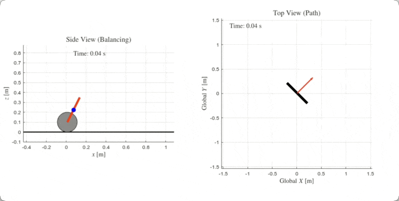

# Two-wheeled self-balancing robot

    

This project is a two-wheeled self-balancing robot (TWSBR).
The simulations are based in OpenModelica and MATLAB.
The controllers implemented are:

- Proportional-Integral-Derivative (PID)
- Linear Quadratic Regulator (LQR)
- Nonlinear Model Predictive Control (NMPC)

## Usage

### OpenModelica

WIP

### MATLAB

MATLAB is used to validate the dynamics of the system.
At the same time, it is used to simulate the MPC controller for both stabilization and path following.
The MPC has been implemented as a pitch, yaw, and linear velocity controller.
It does not control the position as the desire is just to provide a path to follow but without time restrictions.

- The file `twsbr_dynamics.m` contains the function that describes the dynamics of the system.
- The file `twsbr_lqr.m` contains the simulation of the LQR controller. Just hit play.
- The file `twsbr_nmpc.m` contains the simulation of the NMPC controller with white noise and drift simulation. Hit play.
- The file `twsbr_nmpc_global.m` contains the simulation of the NMPC controller without noise or drift. It attempts to follow different paths (e.g. line, circle, sinusoidal, figure8).

Additionally, a simulation of the ground is added to check if the robot hits the ground or not.
See `ground_contact_event.m`.
